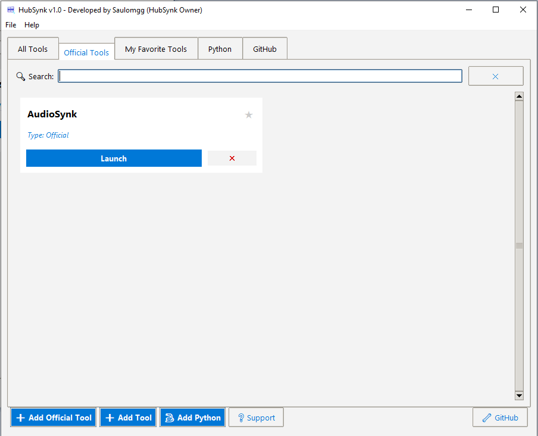
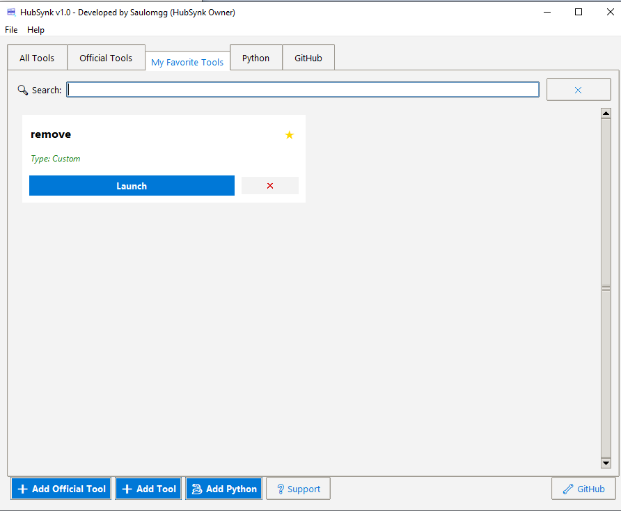
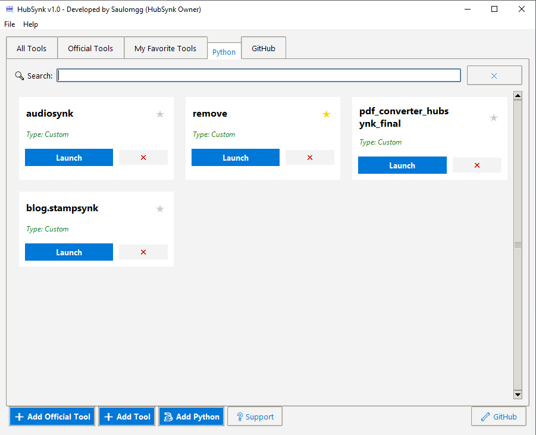
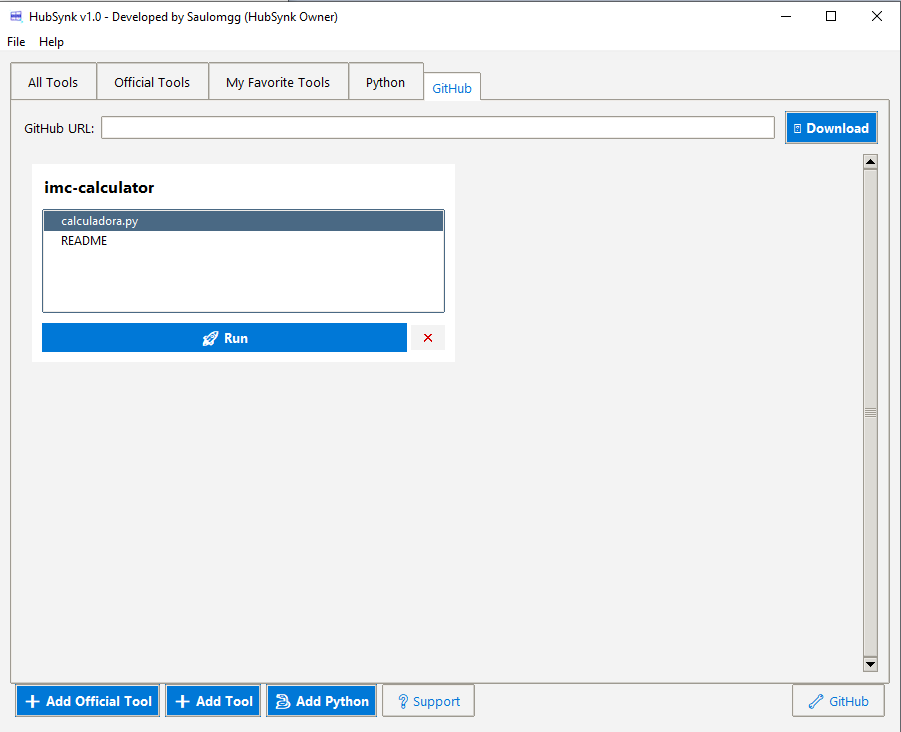

<div align="center">

# 🔷 HubSynk

**Your Essential Windows Productivity Hub**

[](https://github.com/saulomgg/HubSynk/releases)
[](LICENSE)
[]()
[]()
[]()

*Centralize, organize e lance todas as suas ferramentas num único lugar — com segurança criptográfica.*

[⬇️ Download Installer](../../releases/latest) · [📖 Wiki](https://github.com/saulomgg/HubSynk/wiki) · [🐛 Issues](../../issues) · [⭐ Releases](../../releases)

</div>

---

## 📸 Screenshots

<div align="center">

| All Tools | Official Tools |
|:---------:|:--------------:|
|  |  |

| My Favorite Tools | Python Hub |
|:-----------------:|:----------:|
|  |  |

| GitHub Integration |
|:-----------------:|
|  |

</div>

## ✨ O que é o HubSynk?

O **HubSynk** é um hub de produtividade open source para Windows que permite organizar e executar qualquer tipo de ferramenta — executáveis `.exe`, scripts Python `.py`, repositórios do GitHub e pacotes `.hubsynk` verificados criptograficamente — em uma única interface moderna.

## 🚀 Funcionalidades

| Funcionalidade | Descrição |
|---|---|
| **🐍 Python Hub** | Gerencie seu ambiente Python, instale libs via pip e requirements.txt direto pela interface |
| **📦 Pacotes Oficiais** | Instala ferramentas `.hubsynk` com verificação RSA 4096 + SHA-256 |
| **💻 Ferramentas Custom** | Adicione qualquer `.exe` ou `.py` para acesso rápido |
| **🌐 Integração GitHub** | Baixe e execute ferramentas direto de repositórios públicos |
| **⭐ Favoritos** | Marque as ferramentas mais usadas |
| **🔍 Busca em Tempo Real** | Filtre por nome ou descrição instantaneamente |
| **🔐 Segurança** | Verificação criptográfica completa de todos os pacotes oficiais |

## 📦 Instalação

### ⬇️ Opção 1 — Instalador (recomendado)

1. Baixe o **`HubSynk_Setup_v1.0.exe`** na [página de Releases](../../releases/latest)
2. Execute o instalador e siga o wizard
3. Pronto — o HubSynk estará no Menu Iniciar e na Área de Trabalho

### 💻 Opção 2 — Código-fonte (desenvolvedores)

```bash
git clone https://github.com/saulomgg/HubSynk.git
cd HubSynk
pip install -r requirements.txt
python hubsynk.py
```

## 📂 Estrutura do Repositório

```
HubSynk/
├── hubsynk.py              ← Ponto de entrada
├── requirements.txt
├── LICENSE
├── README.md
├── hubsynk_wiki.html       ← Documentação completa
│
├── src/                    ← Código-fonte principal
│   ├── constants.py        ← Configurações e chave pública hardcoded
│   ├── config_manager.py
│   ├── tool_processor.py   ← Verificação criptográfica
│   ├── tool_launcher.py
│   ├── github_manager.py
│   ├── python_manager.py
│   ├── ui.py
│   └── utils.py
│
├── assets/                 ← Ícones e imagens
├── screenshots/            ← Screenshots da interface
├── build/                  ← Scripts de compilação (PyInstaller + Inno Setup)
├── official-tools/         ← Pacotes .hubsynk oficiais
│   ├── catalog.json
│   └── VideoconvertSynk/
│       └── vcsynk.hubsynk
│
└── devtool/                ← Ferramentas para desenvolvedores
    ├── hubsign.py          ← GUI para assinar pacotes (StampSynk)
    ├── public_key.pem      ← Chave pública (referência)
    └── src/
        └── signer_logic.py
```

> **Nota:** A pasta `devtool/` não é distribuída no instalador. Ela é usada apenas por desenvolvedores que criam ferramentas `.hubsynk`.

## 🔐 Segurança

O HubSynk usa verificação de **duas camadas** em todos os pacotes oficiais:

1. **Assinatura RSA-PSS 4096-bit** — garante que o pacote veio do desenvolvedor oficial
2. **Hash SHA-256 do executável** — garante que o `.exe` não foi alterado após a assinatura

Qualquer adulteração invalida a instalação automaticamente.

## 🔑 Usando com Suas Próprias Chaves

> Quer criar e distribuir suas próprias ferramentas `.hubsynk`?

O repositório vem com as chaves do desenvolvedor oficial. Se você quiser criar seu próprio ecossistema:

**1. Gerar novo par de chaves**
```bash
cd devtool
python hubsign.py
```
Aba **"Security Keys"** → **"Generate New Key Pair"**
- `private_key.pem` — **NUNCA suba pro GitHub**
- `public_key.pem` — pode ser compartilhada

**2. Atualizar `src/constants.py`**
```python
PUBLIC_KEY = """-----BEGIN PUBLIC KEY-----
COLE_AQUI_SUA_NOVA_CHAVE_PUBLICA
-----END PUBLIC KEY-----"""
```

**3. Recompilar**
```bash
pyinstaller build/hubsynk.spec
```

> ⚠️ Se a `private_key.pem` vazar, gere um novo par imediatamente e reassine todos os pacotes.

## 🛠️ Ferramentas Oficiais

Os pacotes `.hubsynk` disponíveis ficam em [`official-tools/`](official-tools/).
Veja o [`catalog.json`](official-tools/catalog.json) para a lista completa.

## 🏗️ Compilar o Instalador

```bash
# 1. Instalar dependências
pip install pyinstaller pillow cryptography requests

# 2. Gerar o executável (rodar da raiz do projeto)
pyinstaller build/hubsynk.spec

# 3. Abrir build/hubsynk_installer_new.iss no Inno Setup e compilar
#    Saída: Output/HubSynk_Setup_v1.0.exe
```

Veja [`build/README.md`](build/README.md) para instruções detalhadas.

## 🤝 Contribuindo

- 🐛 **Bugs:** abra uma [Issue](../../issues)
- 💡 **Ideias:** use as [Discussions](../../discussions)
- 🔧 **Código:** fork + Pull Request

## 📋 Changelog

### v1.0
- Lançamento inicial
- Python Hub integrado
- Verificação RSA 4096 + SHA-256 (assinatura + hash do exe)
- Interface Fluent Design inspirada no Windows 11
- Integração GitHub
- StampSynk DevTools

## 📜 Licença

MIT License — veja [LICENSE](LICENSE).

---

<div align="center">

Desenvolvido por <a href="https://github.com/saulomgg/">@saulomgg</a> · Se gostou, deixa uma ⭐

</div>
